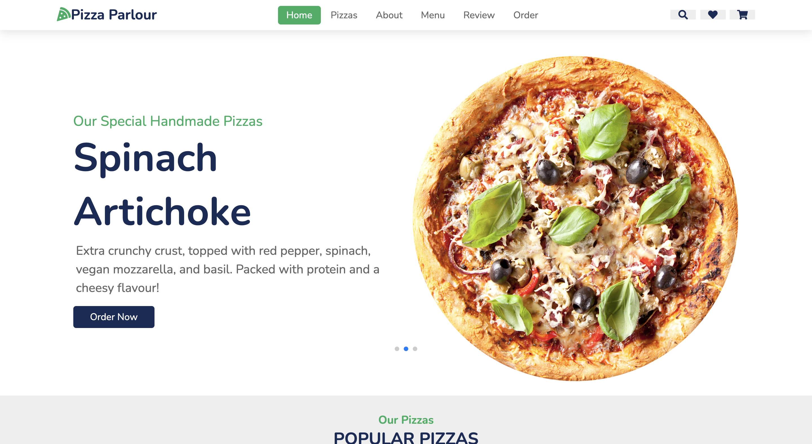

# PIZZA PARLOUR
#### PIZZA PARLOUR Web Application, 16/01/2022
#### By Allan Gikonyo
## Description
The following code represents the web application of Pizza Parlour, a Nairobi based pizza eatery. The web application not only serves as a medium to widen the customer base but also allows customers order different sizes of pizzas with one or more toppings. 

 The following is the demo user interface of the landing page. 

 

<!--  -->

## Setup/Installation Requirements
The landing page has no setup/ installation requirements needed. The landing page can be accessed via any browser. The code is also independent of any app. 

## Known Bugs
None. 

## Technologies Used
HTML, CSS (Bootstrap5),  Javascript(JQuery)
## Support and contact details
If you run into any issues or have questions, ideas or concerns contact gikonyo257@gmail.com or make a contribution to the code.
### License
MIT 
Copyright (c) 2021 agkny